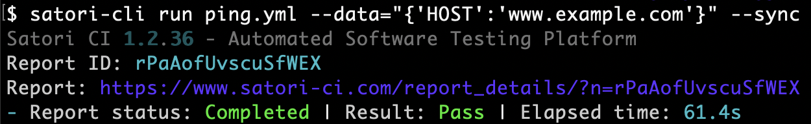
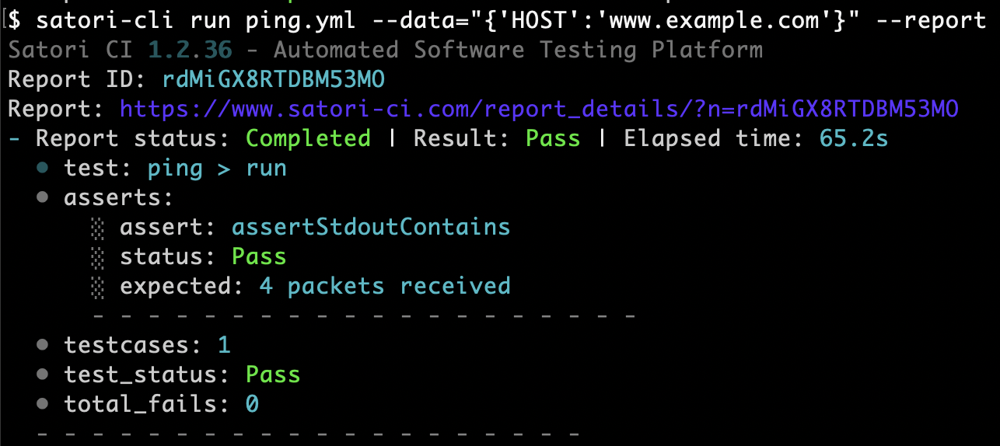
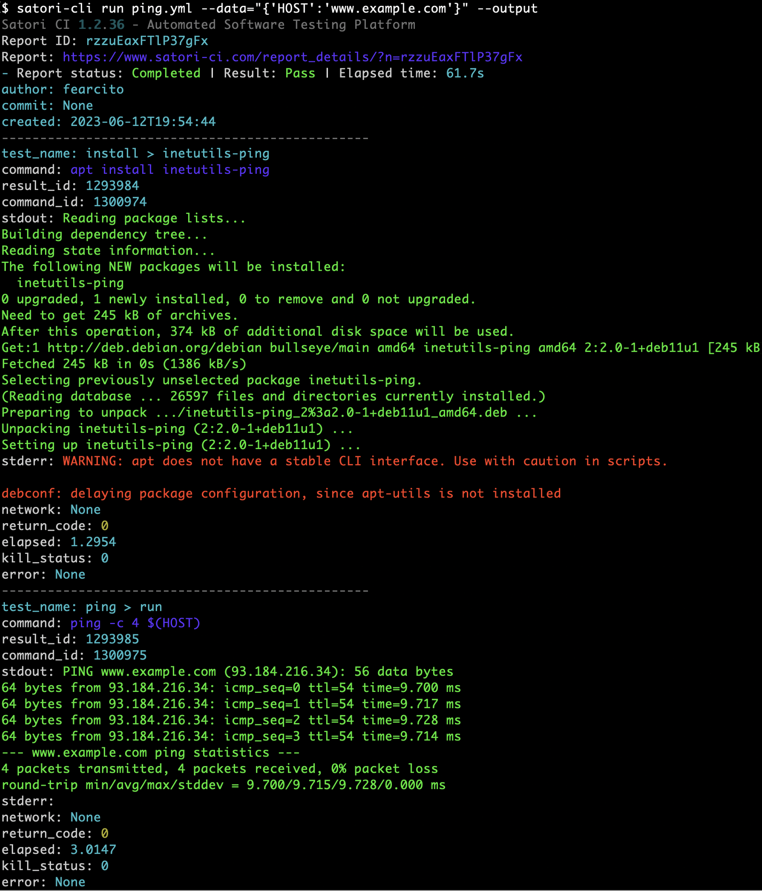

# [Intro](README.md)
## Asynchronous and Synchronous Executions

Satori CI allows you to perform both synchronous and asynchronous testing in combination with other continuous integration (CI) executions. 

## Sample Ping YAML Playbook

Here's a Satori Playbook that asserts that 4 packets have been received when issuing a ping to a certain `HOST`:

```yaml
install:
  inetutils-ping:
  - [ apt install inetutils-ping ]
ping:
  assertStdoutContains: "4 packets received"
  run:
  - [ ping -c 4 $(HOST) ]
```

## Asynchronous by Default

When running a playbook with `satori-cli`, it operates asynchronously by default:

```bash
$ satori-cli run ping.yml --data="{'HOST':'www.example.com'}"  
```

This command will return a report ID that you can use to check the results of the operation at a later time.


## Synchronous Executions

To run the playbook synchronously, use the `--sync` option. Satori CI will then process the output and return the appropriate status code (`0` for successful completion, `1` for failure):

```bash
$ satori-cli run ping.yml --data="{'HOST':'www.example.com'}" --sync
```



### Sync Reports

If you want to get a detailed report immediately after a synchronous run, you can use the `--report` modifier:

```bash
$ satori-cli run ping.yml --data="{'HOST':'www.example.com'}" --report
```



### Sync Outputs

To get the complete output of the execution directly in your terminal when running synchronously, you can use the `--output` modifier:

```bash
$ satori-cli run ping.yml --data="{'HOST':'www.example.com'}" --output
```

This will display all the execution details, including the author, commit, creation date, test name, executed command, standard output and error, return code, and more.

